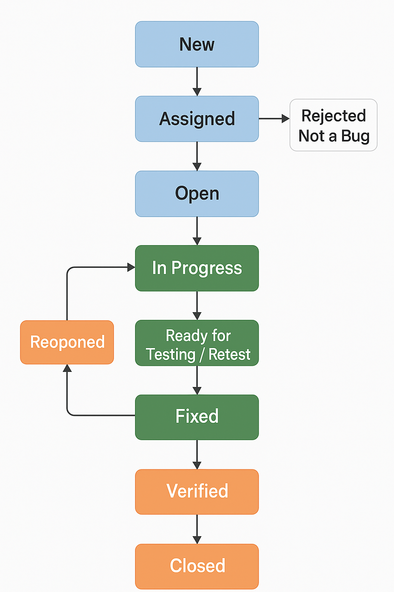

The **Bug Life Cycle** 🐞 is the process that a bug or defect follows from its detection to its resolution. The most common stages are described below:

1. **New**  
   The bug is reported by the tester or user and registered in the tracking system (such as Jira, Bugzilla, etc.).

2. **Assigned**
   The bug is assigned to a developer for analysis and resolution.

3. **Open**
   The developer begins to investigate the bug to understand its cause and plan its correction.

4. **In Progress**
   The developer is actively working on the solution for the bug.

5. **Fixed**
   The developer corrects the error and marks the bug as fixed in the system.

6. **Ready for Testing / Retest**
   The bug is passed to the QA team to verify if it was actually corrected.

7. **Reopened**
   If the tester finds that the bug persists or the correction introduced new problems, it is reopened.

8. **Verified**
   The tester confirms that the bug was corrected correctly and that there are no side effects.

9. **Closed**
   The bug is considered closed. It no longer requires further action.

10. **Rejected / Not a Bug**
   Sometimes the developer determines that the report is not actually a bug (for example, it is expected behavior or user error).

